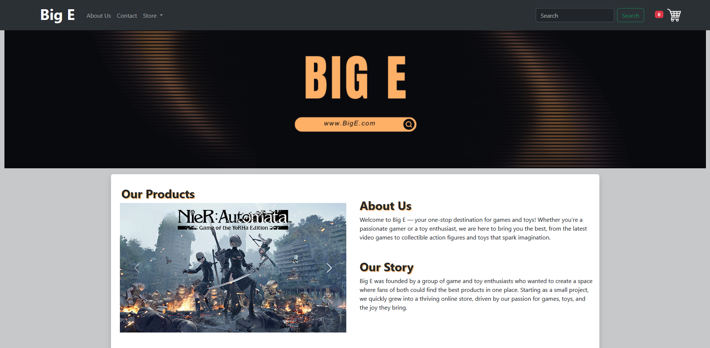

# Big E webUI
Functional front-end mockup of e-commerce website that focus on selling toys and games with product cart and filter systems.

### [Live Webpage](https://ise-s46.github.io/Big_E_webUI/)

## Tools Used

  - HTML
  - CSS
    - Bootstrap Framework
  - JavaScript

## Getting Started

### 1. **Clone the Repository**:

   ```bash
   git clone https://github.com/ISE-S46/Big_E_webUI.git
   cd Big_E_webUI
   ```
### 2. **Launch the Website**:
- Open index.html in your preferred web browser.
    #### Or
- Install live server extension on VSCode and click Go live button

